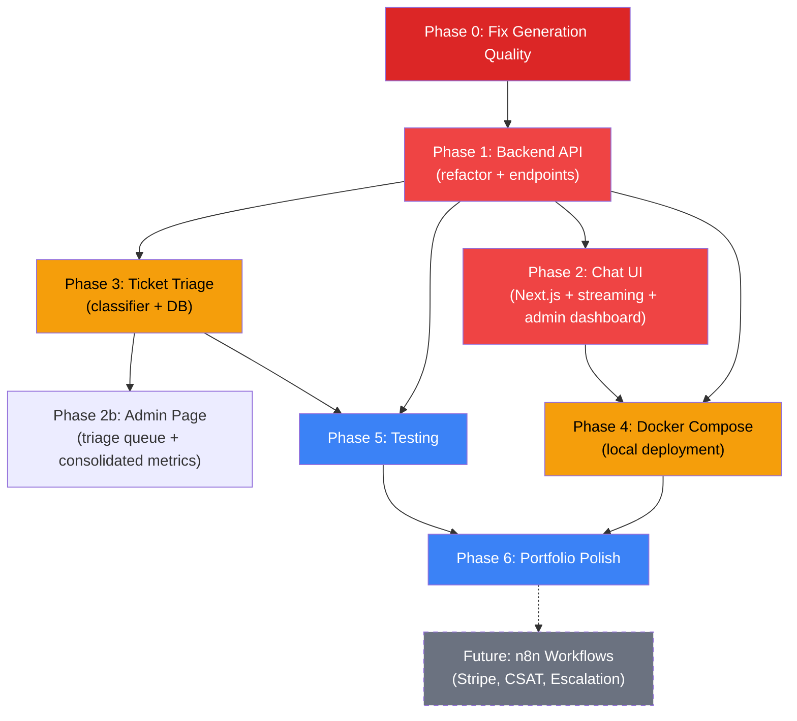

# 🚀 AI Help Desk — Production-Grade Upgrade Plan

> **Goal**: Transform the CLI-based RAG Help Desk into a production-grade, Upwork-portfolio-ready product with a polished Chat UI, Ticket Triage system, proper backend API, and deployment infrastructure.

---

## Current State Summary

Your RAG pipeline is **already sophisticated** — this is not a toy demo. Here's what's built vs. what's left:

### ✅ What's Built (Impressive Foundation)

| Component | Implementation | Quality |
|-----------|---------------|---------|
| **RAG Pipeline** | HyDE → Hybrid Search (Dense BGE + Sparse BM25) → RRF Fusion → Cohere Rerank → Contextual Compression → Generate → Faithfulness Critic | Production-grade |
| **Intent Router** | Groq JSON mode → Pydantic `IntentResult` (ORDER/POLICY/ESCALATE/OTHER) with confidence scores | Solid |
| **Tool Calling** | Order status lookup via FastAPI mock API | Basic but functional |
| **Guardrails** | PII detection (CC, SSN, passwords, API keys), toxicity filter, relevance threshold gating | Good |
| **Evaluation** | LLM-as-judge + ROUGE-L + deterministic retrieval metrics (Hit@5, MRR) + RAGAS integration + regression gates | Excellent |
| **Observability** | LangSmith tracing + per-stage token/cost accounting | Good |
| **Dashboard** | Streamlit eval dashboard with trends, deltas, case inspection | Good |
| **Conversation Memory** | Multi-turn with summarization | Basic |

### 🔲 What's Missing (From Spec Sheet)

| Feature | Spec Section | Status |
|---------|-------------|--------|
| **Chat UI** (web frontend) | M9 | ❌ CLI-only |
| **Ticket Triage & Escalation** | M7, Spec "Ticket Triage (Upgraded)" | ❌ Not started |
| **AI Draft Quality Score** | Spec "AI Reply Drafting" | ❌ Not started |
| **Backend API layer** (REST/WebSocket) | — | ❌ No API, CLI loop only |
| **Production Deployment** | M8 | ❌ No agent Dockerfile, no CI/CD |
| **Admin Dashboard metrics** | Spec "Admin Dashboard" | ❌ Current dashboard is eval-only |
| **n8n Workflow Automation** | Spec "n8n Workflow Automation" | ❌ Not started |
| **Expanded eval set** | EVALUATION_IMPROVEMENT_PLAN Phase 5 | ❌ Only 12 reviewed cases |

### ⚠️ Known Quality Issues

- **Generation quality is low**: faithfulness=0.40, answer_relevancy=0.40 (target is ≥0.80)
- **Requirements not pinned** — reproducibility risk
- **Test coverage is minimal** — 4 unit tests for evaluator only
- **Orders API is a stub** — only 3 hardcoded mock orders
- **`Rag_Agent.py` is 1,093 lines** — monolith, hard to test/extend

---

## Decisions (Resolved)

| Decision | Choice | Rationale |
|----------|--------|----------|
| **Frontend** | Next.js (React) | Professional streaming UI, portfolio-worthy |
| **Authentication** | None — open/anonymous | Production-grade demo for learning + client showcase |
| **Streamlit Dashboard** | Consolidate into Next.js admin page | Single unified app, no separate tool |
| **Generation Quality** | Fix FIRST before building UI | No point in a pretty UI with bad answers |
| **n8n / Stripe Workflows** | Deferred to post-UI | Reduces scope, focus on core product first |
| **Deployment** | Docker Compose local only | No cloud deployment for now |
| **LLM Provider** | Keep Groq (Llama 3.3 70B + 8B) | Free/cheap, already working |
| **Triage Persistence** | SQLite (local) → PostgreSQL (future) | Zero config for dev, migration path for prod |

---

## Proposed Changes

### Phase 0: Fix Generation Quality (Do First)

> **Why first**: Faithfulness=0.40, answer_relevancy=0.40 vs targets of ≥0.80. No point building a beautiful UI that gives bad answers.

#### [MODIFY] [Rag_Agent.py](file:///c:/Users/gurno/OneDrive/Desktop/Projects/Help Desk/Ai-HelpDesk/Rag_Agent.py)
- **Investigate** the critic pipeline — the generate-then-verify pattern may be too aggressive (rejecting good answers) or not aggressive enough (letting hallucinations through)
- **Tune system prompt** — tighten grounding instructions, add explicit "cite your sources" directives
- **Evaluate chunk quality** — check if semantic chunking is producing good boundaries, adjust `SEMANTIC_BREAK_THRESHOLD` if needed
- **Review contextual compression** — may be stripping too much relevant context before generation
- **Calibrate critic thresholds** — the Llama 3.1 8B critic may have misaligned scoring

#### [MODIFY] [rag_eval_set.reviewed.json](file:///c:/Users/gurno/OneDrive/Desktop/Projects/Help Desk/Ai-HelpDesk/rag_eval_set.reviewed.json)
- Expand from 12 to 30+ reviewed cases (Phase 5 of EVALUATION_IMPROVEMENT_PLAN)
- Add edge cases: multi-hop questions, ambiguous queries, adversarial inputs

#### Verification:
```bash
# Run evaluation before and after changes to measure improvement
python evaluate_rag.py .\rag_eval_set.reviewed.json --fail-on-threshold --min-faithfulness 0.80 --min-answer-relevancy 0.80 --min-context-recall 0.80
```

**Target**: Get faithfulness ≥ 0.80 and answer_relevancy ≥ 0.80 before proceeding.

---

### Phase 1: Backend API Layer (Foundation)

> **Why next**: Everything else depends on having a proper API. The CLI loop in `Rag_Agent.py` can't serve a web frontend.

#### [MODIFY] [Rag_Agent.py](file:///c:/Users/gurno/OneDrive/Desktop/Projects/Help Desk/Ai-HelpDesk/Rag_Agent.py)
- **Extract** core logic into a modular `app/` package (the file stays as a thin CLI entry point)
- Keep all existing functionality intact — this is a refactor, not a rewrite
- The 1,093-line monolith becomes ~8 focused modules

#### [NEW] `app/` — Python package structure

```
app/
├── __init__.py
├── main.py                  # FastAPI app entry point with CORS, middleware
├── config.py                # Pydantic Settings (loads .env, validates)
├── rag/
│   ├── __init__.py
│   ├── ingestion.py         # PDF → Unstructured → semantic chunking → Qdrant
│   ├── retrieval.py         # HyDE → hybrid search → RRF → Cohere rerank → compress
│   └── generation.py        # System prompt + context → Groq generate → critic verify
├── tools/
│   ├── __init__.py
│   └── orders.py            # Order ID extraction + API lookup (from Rag_Agent.py)
├── routing/
│   ├── __init__.py
│   └── intent.py            # IntentResult classifier (ORDER/POLICY/ESCALATE/OTHER)
├── triage/                  # (Phase 3)
│   ├── __init__.py
│   ├── classifier.py
│   └── models.py
├── guardrails/
│   ├── __init__.py
│   └── safety.py            # PII detection, toxicity, relevance threshold
├── memory/
│   ├── __init__.py
│   └── session.py           # Session dataclass, multi-turn history, summarization
├── api/
│   ├── __init__.py
│   ├── routes.py            # REST + WebSocket endpoints
│   ├── schemas.py           # Pydantic request/response models
│   └── middleware.py        # CORS, rate limiting, error handling
├── db/
│   ├── __init__.py
│   ├── database.py          # SQLite connection (async via aiosqlite)
│   └── models.py            # SQLAlchemy models (conversations, messages, triage)
└── observability/
    ├── __init__.py
    └── tracing.py           # Refactored from observability.py (LangSmith + cost tracking)
```

#### API Endpoints

| Method | Path | Purpose |
|--------|------|---------|
| `POST` | `/api/chat` | Send message, get response (non-streaming) |
| `WebSocket` | `/api/chat/ws/{session_id}` | Streaming chat with token-by-token response |
| `GET` | `/api/conversations` | List conversation history |
| `GET` | `/api/conversations/{id}` | Get full conversation with messages |
| `GET` | `/api/triage/tickets` | List triaged tickets (Phase 3) |
| `PATCH` | `/api/triage/tickets/{id}` | Update ticket status (Phase 3) |
| `GET` | `/api/health` | Health check (Qdrant connectivity, LLM reachability) |
| `GET` | `/api/stats` | Dashboard stats (query volume, latency, costs) |

#### WebSocket Message Protocol

```json
// Client → Server
{ "type": "message", "content": "What is the return policy?", "session_id": "uuid" }

// Server → Client (streaming)
{ "type": "token", "content": "Based" }
{ "type": "token", "content": " on" }
{ "type": "token", "content": " our" }
// ...
{ "type": "sources", "data": [{"chunk": "...", "score": 0.87, "source": "Store_Return_Policy.pdf"}] }
{ "type": "tool_call", "name": "check_order_status", "args": {"order_id": "ORD-001"}, "status": "executing" }
{ "type": "tool_result", "name": "check_order_status", "result": {"status": "shipped", "eta": "..."} }
{ "type": "triage", "urgency": "P3", "category": "shipping" }
{ "type": "done", "message_id": "uuid" }
```

#### [MODIFY] [requirements.txt](file:///c:/Users/gurno/OneDrive/Desktop/Projects/Help Desk/Ai-HelpDesk/requirements.txt)
- **Pin all versions** for reproducibility
- Add: `pydantic-settings`, `sqlalchemy[asyncio]`, `aiosqlite`, `websockets`, `alembic`

---

### Phase 2: Chat UI (The Hero Feature)

> **Impact**: This is what makes the project portfolio-worthy. A CLI demo doesn't sell on Upwork — a beautiful, streaming chat interface does.

#### [NEW] `frontend/` — Next.js Chat Application

```
frontend/
├── package.json
├── next.config.js
├── public/
│   └── favicon.ico
├── src/
│   ├── app/
│   │   ├── layout.js            # Root layout: Inter font, metadata, dark mode
│   │   ├── page.js              # Main chat page
│   │   ├── globals.css          # Design system: tokens, glassmorphism, animations
│   │   └── admin/
│   │       └── page.js          # Triage ticket queue (Phase 3)
│   ├── components/
│   │   ├── ChatWindow.js        # Main chat container with message list
│   │   ├── MessageBubble.js     # User/agent message with typing animation
│   │   ├── ChatInput.js         # Input bar with send button + keyboard shortcuts
│   │   ├── Sidebar.js           # Conversation history list with search
│   │   ├── SourceCard.js        # Expandable RAG citation cards with scores
│   │   ├── ToolCallCard.js      # Animated "Looking up order..." → result display
│   │   ├── TriageBadge.js       # P1-P4 priority + category pill badges
│   │   ├── Header.js            # Branding + session controls
│   │   ├── ThemeToggle.js       # Dark ↔ light mode toggle
│   │   └── StreamingText.js     # Token-by-token text renderer with cursor
│   ├── hooks/
│   │   ├── useChat.js           # WebSocket connection + streaming state
│   │   ├── useConversations.js  # Conversation CRUD operations
│   │   └── useTheme.js          # Theme management with localStorage
│   └── lib/
│       ├── api.js               # HTTP + WebSocket client utilities
│       └── constants.js         # API URLs, theme colors, etc.
```

#### Design Specifications

**Visual Direction**: Dark mode default, glassmorphism cards, gradient accents, smooth micro-animations

- **Color Palette**: Deep navy background (`#0a0e1a`), glass panels with `backdrop-filter: blur(12px)`, electric blue accent (`#3b82f6`), success green (`#10b981`), warning amber (`#f59e0b`), critical red (`#ef4444`)
- **Typography**: Inter (Google Fonts) — clean, modern, highly readable
- **Message Bubbles**: Agent messages have subtle glass background + left border accent. User messages are solid accent color with rounded corners
- **Streaming**: Tokens appear word-by-word with a blinking cursor (like ChatGPT/Claude)
- **Source Citations**: Collapsible cards below the answer showing chunk text, relevance score bar, and source file name
- **Tool Calls**: Animated cards showing "🔍 Looking up order ORD-001..." with a spinner → slides open to show structured result
- **Triage Badge**: Small colored pill on each conversation (P1 = red, P2 = amber, P3 = blue, P4 = gray) + category tag
- **Sidebar**: Conversation list with preview text, timestamp, triage badge. Search bar at top
- **Responsive**: Sidebar collapses to hamburger on mobile. Full-width chat on small screens
- **Micro-animations**: Message fade-in from bottom, send button pulse, sidebar slide, theme transition

---

### Phase 3: Ticket Triage & Escalation (M7)

> **Spec requirement**: Classify each conversation by urgency and category, auto-escalate critical issues.

#### [NEW] `app/triage/classifier.py`

Uses the existing Groq intent router pattern (JSON mode + Pydantic) but extended for triage:

```python
class TriageResult(BaseModel):
    category: Literal["billing", "shipping", "product_defect", "account", "returns", "other"]
    priority: Literal["P1", "P2", "P3", "P4"]
    confidence: float  # 0.0 - 1.0
    escalate_to_human: bool
    extracted_entities: dict  # product_mentioned, error_code, customer_tier
    reasoning: str  # Chain-of-thought (logged, not shown to user)
```

**Hybrid approach** (from spec — AI + rules engine):
- **AI classification**: Groq fast model (Llama 3.1 8B) with structured output
- **Rules override**:
  - Contains "payment failed" / "charge" / "invoice" → force `billing` + `P2`
  - Contains "data loss" / "site down" / "production" → force `P1` + `escalate_to_human=true`
  - Confidence < 0.65 → route to human review queue
- **Auto-escalation**:
  - P1/P2 → immediate escalation flag
  - 3+ consecutive low-retrieval-score responses → escalation
  - Intent = ESCALATE from router → escalation

#### [NEW] `app/triage/models.py`
- SQLAlchemy models: `Conversation`, `Message`, `TriageRecord`
- `TriageRecord` stores: urgency, category, confidence, escalated, resolved_by, resolved_at

#### [NEW] `app/db/models.py` + `app/db/database.py`
- Async SQLite via SQLAlchemy + aiosqlite
- Tables: `conversations`, `messages`, `triage_records`
- Migration support via Alembic

#### Admin UI — Consolidated Dashboard (replaces Streamlit)

The Next.js admin page (`/admin`) replaces `rag_dashboard.py` entirely:

- **Ticket queue**: Table sorted by priority (P1 first), filterable by category/status
- **Ticket detail**: Full conversation view + triage metadata + resolution controls
- **Eval metrics panel**: Faithfulness, relevancy, context precision/recall trends (migrated from Streamlit)
- **Operational metrics**: Query volume, latency (p50/p95), error rate, tool usage distribution
- **Cost tracking**: Cost-per-ticket, token usage breakdown, model-level costs
- **Analytics cards**: Escalation rate, category distribution, avg resolution time
- **Bulk actions**: Assign, resolve, re-triage

> [!NOTE]
> `rag_dashboard.py` will be kept for backwards compatibility but marked as deprecated in the README. All its functionality moves to `/admin`.

---

### Phase 4: Production Deployment (M8 — Local Docker Only)

> **Goal**: `docker compose up` gets the entire stack running — backend, frontend, Qdrant, orders API. No cloud deployment.

#### [NEW] `Dockerfile` (multi-stage for the backend)
```dockerfile
FROM python:3.11-slim AS backend
WORKDIR /app
COPY requirements.txt .
RUN pip install --no-cache-dir -r requirements.txt
COPY app/ app/
COPY Rag_Agent.py .
COPY Store_Return_Policy.pdf .
COPY observability.py .
EXPOSE 8080
CMD ["uvicorn", "app.main:app", "--host", "0.0.0.0", "--port", "8080"]
```

#### [NEW] `frontend/Dockerfile` (Next.js production build)
```dockerfile
FROM node:20-alpine AS build
WORKDIR /app
COPY package*.json .
RUN npm ci
COPY . .
RUN npm run build

FROM node:20-alpine AS runner
WORKDIR /app
COPY --from=build /app/.next/standalone ./
COPY --from=build /app/.next/static .next/static
COPY --from=build /app/public public
EXPOSE 3000
CMD ["node", "server.js"]
```

#### [MODIFY] [docker-compose.yml](file:///c:/Users/gurno/OneDrive/Desktop/Projects/Help Desk/Ai-HelpDesk/docker-compose.yml)
- Add services: `backend`, `frontend`
- Add health checks for all services
- Proper networking between services
- Environment variable passthrough from `.env`
- Named volumes for persistent data

#### [NEW] `.github/workflows/ci.yml`
```yaml
# Lint (ruff) → Unit Tests (pytest) → Build Docker images → (optional) Eval gate
```

#### [NEW] `.github/workflows/nightly-eval.yml`
- Scheduled nightly: run evaluation, alert on metric degradation > 5%

---

### Phase 5: Code Quality & Testing

#### [NEW] `pyproject.toml`
- Modern Python project configuration
- Ruff linting rules
- Pytest configuration with coverage settings

#### Expanded test suite:

```
tests/
├── conftest.py                # Shared fixtures (mock Groq client, mock Qdrant, etc.)
├── unit/
│   ├── test_ingestion.py      # Chunking logic, metadata extraction
│   ├── test_retrieval.py      # HyDE generation, search, RRF fusion, reranking
│   ├── test_guardrails.py     # PII patterns, toxicity filter, edge cases
│   ├── test_intent.py         # Intent classification accuracy
│   ├── test_memory.py         # Session management, summarization
│   ├── test_triage.py         # Triage classification + rules engine
│   └── test_generation.py     # Answer generation + critic pipeline
├── integration/
│   ├── test_api.py            # REST endpoint tests
│   ├── test_websocket.py      # WebSocket streaming tests
│   └── test_orders.py         # Orders API integration
└── test_evaluate_rag.py       # (existing, keep)
```

#### Error handling improvements:
- `tenacity` retry decorators already exist for LLM calls — extend to Qdrant and Cohere
- Structured error responses from the API (`{"error": "...", "code": "...", "details": {...}}`)
- WebSocket reconnection logic in frontend
- Graceful degradation when Cohere/LangSmith are unavailable (already partially done)

#### [MODIFY] [.gitignore](file:///c:/Users/gurno/OneDrive/Desktop/Projects/Help Desk/Ai-HelpDesk/.gitignore)
- Add: `frontend/node_modules/`, `frontend/.next/`, `*.db`, `*.sqlite`

---

### Phase 6: Upwork Portfolio Polish

#### [MODIFY] [README.md](file:///c:/Users/gurno/OneDrive/Desktop/Projects/Help Desk/Ai-HelpDesk/README.md)
- Add screenshots/GIFs of the Chat UI
- Add Mermaid architecture diagram
- Add performance benchmarks and RAGAS scores
- Lead with **outcomes** not features (per spec advice): deflection rate, cost-per-ticket, faithfulness score
- Professional badges (Python, Docker, License, CI status)

#### [NEW] `docs/` directory
```
docs/
├── API.md              # Full API reference with examples
├── DEPLOYMENT.md       # Step-by-step deployment guide
├── ARCHITECTURE.md     # Detailed architecture with diagrams
└── DEMO_SCRIPT.md      # 2-minute demo walkthrough for recordings
```

#### [MODIFY] [.env.example](file:///c:/Users/gurno/OneDrive/Desktop/Projects/Help Desk/Ai-HelpDesk/.env.example)
- Group variables by service with comments
- Document all new variables (database URL, frontend URL, etc.)

#### Portfolio-specific additions:
- **Demo mode**: Pre-seeded conversations and triage records for instant showcase
- **One-command setup**: `docker compose up` gets everything running
- **Cost-per-ticket metric** on admin dashboard (the single most impressive metric per your spec)

---

## Implementation Order & Dependencies



| Phase | Effort | Priority | Depends On |
|-------|--------|----------|------------|
| **Phase 0**: Fix Generation Quality | 2-3 hrs | 🔴 Do First | — |
| **Phase 1**: Backend API | 4-6 hrs | 🔴 Critical | Phase 0 |
| **Phase 2**: Chat UI + Admin Dashboard | 6-8 hrs | 🔴 Critical | Phase 1 |
| **Phase 3**: Ticket Triage | 3-4 hrs | 🟡 High | Phase 1 |
| **Phase 4**: Docker Compose (local) | 3-4 hrs | 🟡 High | Phase 1, 2 |
| **Phase 5**: Testing | 3-4 hrs | 🟠 Medium | Phase 1, 3 |
| **Phase 6**: Polish | 2-3 hrs | 🟠 Medium | All |
| *Future*: n8n Workflows | TBD | ⬜ Deferred | Phase 6 |

**Total estimated effort**: ~24-32 hours

---

## Verification Plan

### Automated Tests
```bash
# Backend unit + integration tests
pytest tests/ -v --cov=app --cov-report=html

# RAG evaluation (ensure no regression from refactor)
python evaluate_rag.py .\rag_eval_set.reviewed.json --retrieval-only --fail-on-threshold --min-hit-at-5 0.90 --min-mrr 0.70

# Linting
ruff check app/
cd frontend && npx eslint src/
```

### Manual Verification
- **Chat UI**: Open browser → send policy questions → verify streaming responses with citations
- **Tool Calls**: Ask "Check order ORD-001" → verify animated tool call card → correct result
- **Triage**: Send "My payment failed!" → verify P2/billing classification → escalation badge
- **Streaming**: Watch tokens appear word-by-word, verify no dropped tokens
- **WebSocket resilience**: Disconnect WiFi → reconnect → verify session continues
- **Docker**: `docker compose up` → all 4 services healthy → test full flow
- **Mobile**: Open on phone → verify responsive layout, sidebar collapse
- **Dark/Light mode**: Toggle → all components render correctly

### Performance Targets
| Metric | Target |
|--------|--------|
| First message response (cold start) | < 4s |
| Subsequent message response | < 3s |
| WebSocket streaming first token | < 1s |
| UI initial load (Lighthouse) | > 85 performance |
| Docker compose full startup | < 45s |
| Triage classification latency | < 500ms |
